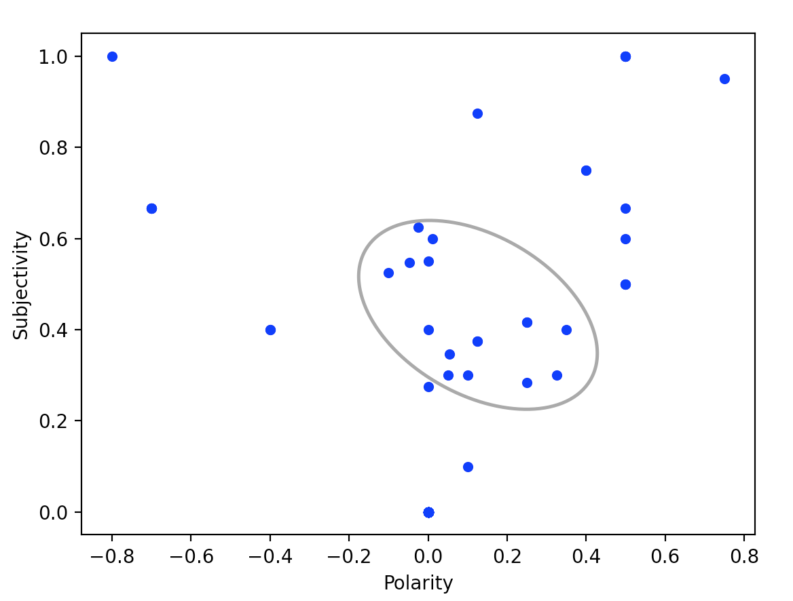
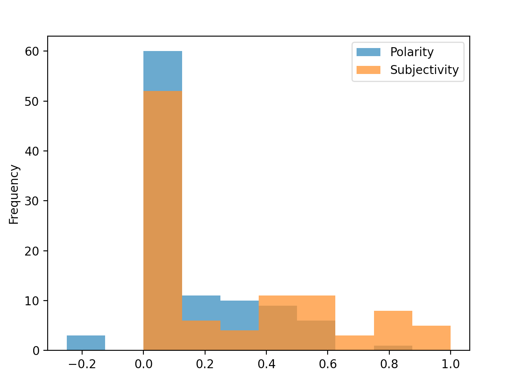
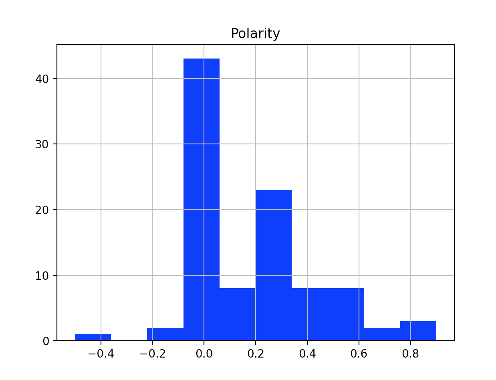
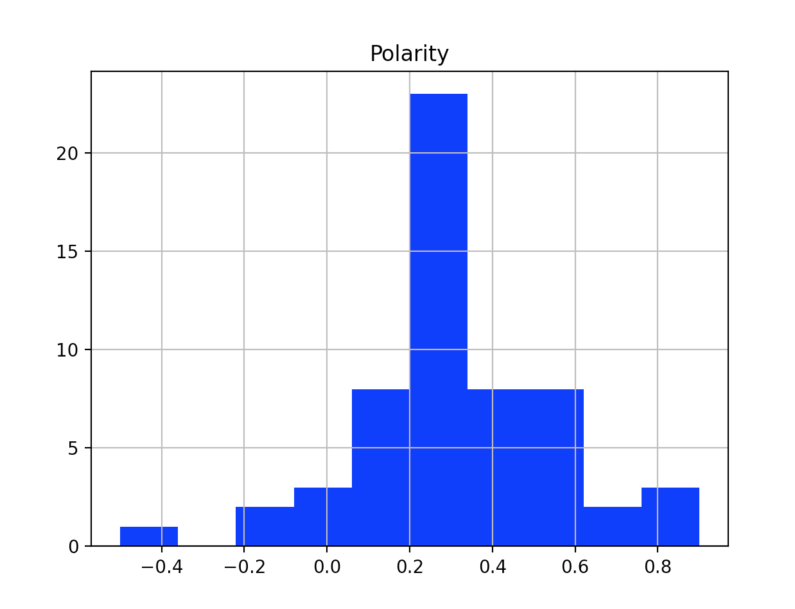
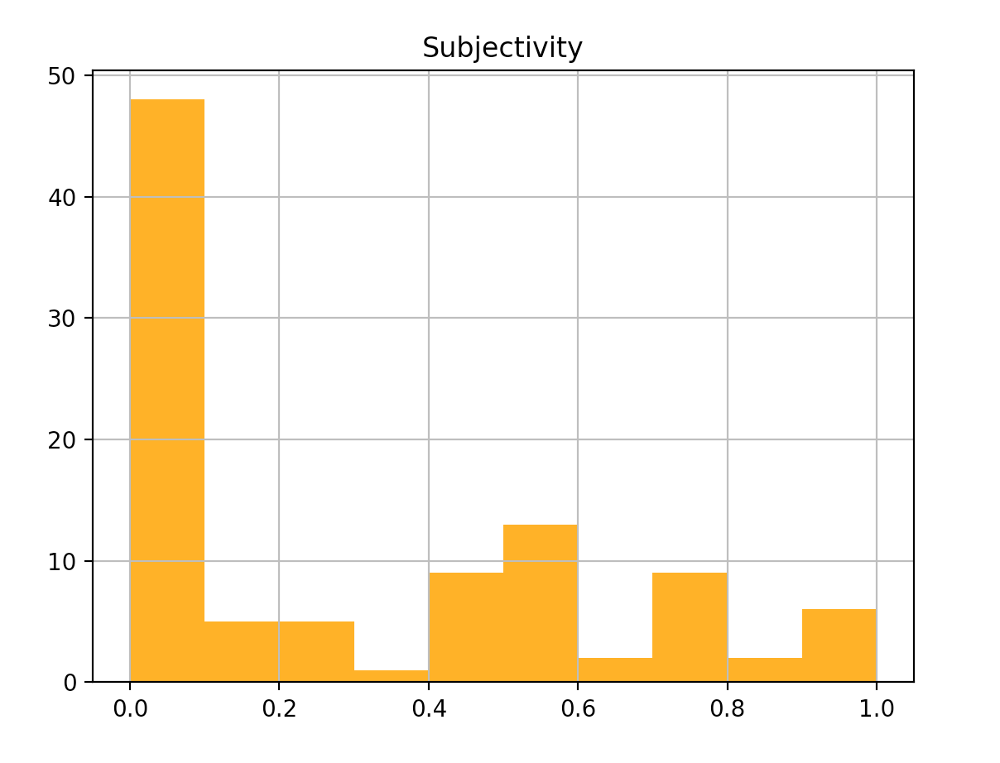
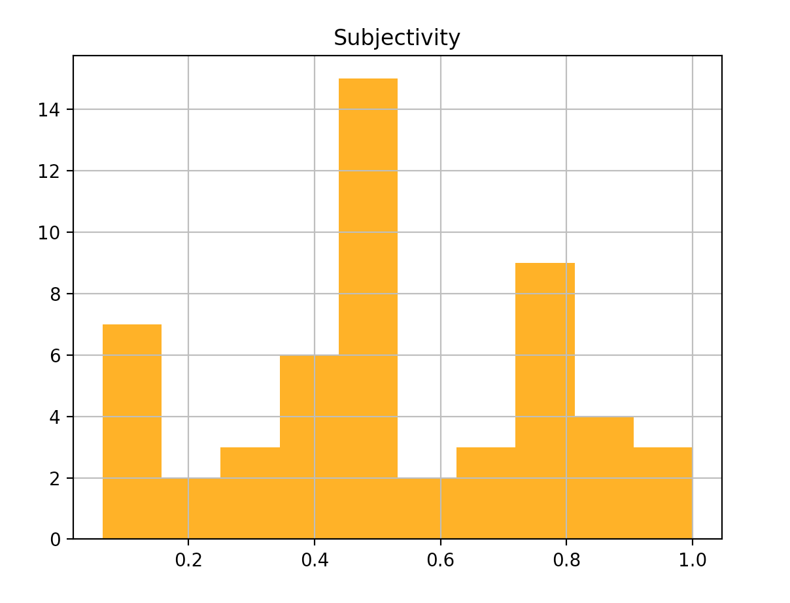

# TwitterSentimentAnalysis

Program allows to pull twitter data (1000) in the form of tweets by keyword using tweepy API. Uses textBlob to run Sentiment analysis on the tweets by loop. Leverages Pandas Dataframes and Plots histogram of results.

# Visualizations

